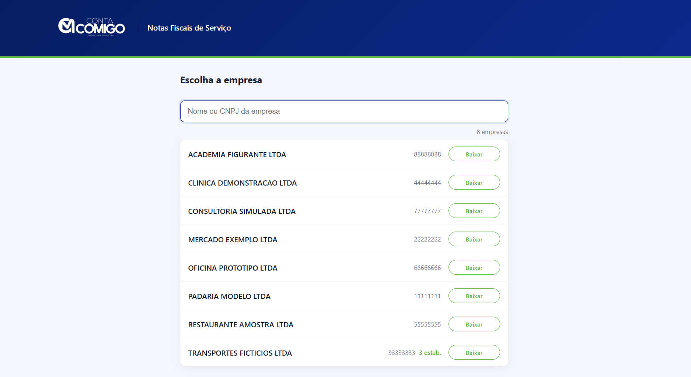

# Portal Nacional NFS-e

Programa em Go que baixa os XMLs de NFS-e (Nota Fiscal de Serviço eletrônica) do **Ambiente de Dados Nacional (ADN)**, usando certificado digital A1 para autenticar.

A única dependência externa é a biblioteca que lê certificados PKCS#12. A interface web usa apenas a biblioteca padrão e fica compilada dentro do executável.

---

## O problema

Um escritório contábil precisa importar as NFS-e de centenas de empresas todo início de mês. O sistema que eles usam hoje resolve as matrizes, mas não baixa as notas das filiais, e também não traz as notas emitidas, porque importa só o que a empresa recebeu. O resto tem que ser feito à mão, empresa por empresa, no portal web que tem captcha.

Este programa cobre essa parte: busca os XMLs direto da API oficial e deixa os arquivos organizados em disco, prontos para importação.

---

## A interface



Quem opera o programa no dia a dia são auxiliares contábeis, então linha de comando não serve. O comando `--tela` sobe um servidor local e a pessoa trabalha pelo navegador: busca a empresa pelo nome ou CNPJ, clica, e vê quantas notas vieram e em que pasta foram salvas.

A lista é montada a partir de um CSV de clientes, agrupada pela raiz do CNPJ. Assim um clique baixa a matriz e todas as filiais da mesma empresa.

---

## Como funciona

O ADN não aceita consulta por data. Ele funciona como uma caixa postal numerada: cada documento destinado a um CNPJ recebe um número sequencial (o NSU), e a única pergunta possível é "o que chegou depois do NSU X?".

```
1. Abre o certificado .pfx (convertendo o formato se precisar)
2. Autentica no ADN por TLS mútuo, usando o certificado como credencial
3. Pede lotes a partir do último NSU lido      ── repete até acabar
4. Cada documento vem compactado em gzip e codificado em base64
5. Desembrulha e grava o XML em disco
6. Salva o último NSU para a próxima execução continuar de onde parou
```

A primeira execução de uma empresa traz o histórico inteiro. As seguintes trazem só o que chegou desde a última vez. Na prática, uma empresa com anos de notas leva alguns minutos na primeira vez e poucos segundos nos meses seguintes.

---

## Decisões técnicas

**Certificados em BER que o Go não lê.** Os certificados ICP-Brasil mais antigos vêm codificados em BER, e a biblioteca padrão do Go só aceita DER. Tentei escrever um conversor em Go, mas não funcionou: esses arquivos têm várias camadas de BER aninhadas, e o conversor genérico corrompia o resultado. Resolvi chamando o PowerShell para reimportar e reexportar o certificado, já que o Windows regrava em DER. O resultado vai para um cache, então a conversão acontece uma vez só por certificado.

**Baixar filiais com o certificado da matriz.** O e-CNPJ da matriz vale para a pessoa jurídica inteira. A API tem um parâmetro opcional chamado `cnpjConsulta`, e com ele dá para pedir as notas de uma filial estando autenticado como matriz. Cada estabelecimento tem numeração de NSU própria, então cada um precisa do seu ponteiro.

**O download não pode responder na mesma requisição.** A primeira carga de uma empresa grande leva vários minutos, e o navegador desiste antes disso. Resolvi disparando uma goroutine e respondendo assim que o pedido chega. A página consulta o estado a cada dois segundos até terminar. Esse estado fica num mapa protegido por mutex, e a função de leitura devolve uma cópia, para não entregar o mesmo ponteiro que a goroutine está escrevendo.

**A pausa entre requisições.** O ADN responde HTTP 429 quando recebe requisições muito seguidas. Na primeira versão deixei dois segundos de pausa entre lotes, por precaução. Depois coloquei um cronômetro em cada busca e vi que ela leva de 0,2 a 0,4 segundo, ou seja, quase todo o tempo de execução era espera. Testei com um segundo e rodaram 13 lotes seguidos sem nenhum 429, o que cortou o tempo pela metade. Não desci mais porque cada 429 custa cinco segundos de backoff, e o ganho ficaria pequeno demais para o risco.

**Gravar não é o mesmo que chegar.** Numa versão anterior os XMLs eram gravados direto numa pasta sincronizada em nuvem. O programa relatou 12.456 arquivos salvos e nenhuma falha, mas nada tinha chegado ao destino: o sistema operacional aceitava a gravação e o cliente de sincronização falhava depois, sem avisar. Rodei o mesmo código apontando para o disco local e gravou 12.476 de 12.476. Desde então o destino padrão é local.

**Escrita atômica do estado.** O arquivo que guarda os ponteiros é escrito num temporário e depois renomeado por cima do definitivo, então uma interrupção no meio não corrompe o arquivo antigo. O ponteiro também só avança quando o lote inteiro foi gravado sem falha. Preferi que o programa repita documentos a arriscar pular algum, porque arquivo repetido é só sobrescrito.

---

## Requisitos

- Go 1.21 ou superior
- Certificado digital A1 (`.pfx` ou `.p12`)
- PowerShell 7 (`pwsh`), usado apenas para reconverter certificados em BER. Certificados já em DER, ou já convertidos no cache, não precisam.

---

## Configuração

Copie o arquivo de exemplo:

```bash
cp config.exemplo.json config.json
```

```json
{
  "certificadosDir": "C:\\caminho\\para\\certificados",
  "convertidosDir":  "C:\\caminho\\para\\convertidos",
  "clientesCSV":     "C:\\caminho\\para\\clientes.csv",
  "xmlBaseDir":      "",
  "estadoPath":      ""
}
```

Os campos deixados vazios assumem valores padrão e criam as pastas sozinhos: `~/Documents/NFSE` para os XMLs e `~/Documents/NFSE/_controle/nsu.json` para o ponteiro. Isso permite rodar numa máquina nova sem configurar nada.

O `config.json` não vai para o controle de versão, porque contém caminhos internos. O arquivo `clientes.exemplo.csv` mostra o formato esperado da lista de empresas.

---

## Uso

```bash
go run . --tela                          # interface web em http://localhost:8080
go run . --empresa <raiz8> [cnpj14...]   # uma empresa; sem CNPJ, lê os do CSV
go run . --todas [limite]                # todas as empresas do CSV
go run . --scan                          # lista os .pfx e a senha extraída de cada nome
go run . --cert <raiz8>                  # mostra caminho e senha de uma raiz
go run . --resetar <raiz8|cnpj14>        # apaga o ponteiro e força rebaixar tudo
go run . <arquivo.pfx> <senha> [cnpj14]  # modo direto, sem CSV
```

O `--resetar` existe porque o programa decide o que baixar olhando só o ponteiro, nunca o disco. Se alguém apagar os XMLs sem apagar o ponteiro, o programa entende que já entregou aquelas notas e não busca de novo.

---

## Saída em disco

```
NFSE/
└── RAZAO SOCIAL_00000000/          ← raiz do CNPJ, agrupa matriz e filiais
    └── 00000000000100/             ← estabelecimento
        ├── 2026-07/                ← mês de emissão
        │   └── <chave-de-acesso>.xml
        └── _eventos/
            └── <chave-de-acesso>-<nsu>.xml
```

O mês vem da data de emissão lida do próprio XML. Usei o formato `AAAA-MM` para as pastas ficarem em ordem cronológica no explorador de arquivos. Os eventos, como cancelamentos, levam o NSU no nome porque chegam com a mesma chave de acesso da nota que alteram.

---

## Limitações

- A API não filtra por data, então a filtragem por competência precisa ser feita depois, sobre os XMLs já baixados.
- Notas emitidas e recebidas chegam misturadas. Para separar é preciso comparar o CNPJ do prestador, que está dentro da chave de acesso, com o CNPJ consultado.
- Só um download por vez. O arquivo de ponteiro é único, e duas execuções ao mesmo tempo sobrescreveriam o registro uma da outra.
- A lista de filiais vem do CSV. O programa não descobre estabelecimentos sozinho.
- A reconversão de certificados BER depende do Windows.

---

## Stack

Go, TLS mútuo (mTLS), PKCS#12, REST, gzip, base64, `net/http`, `html/template`, `//go:embed`.

---

## Licença

MIT
